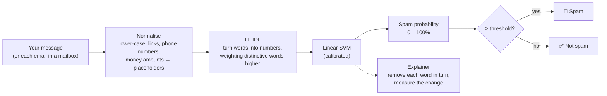
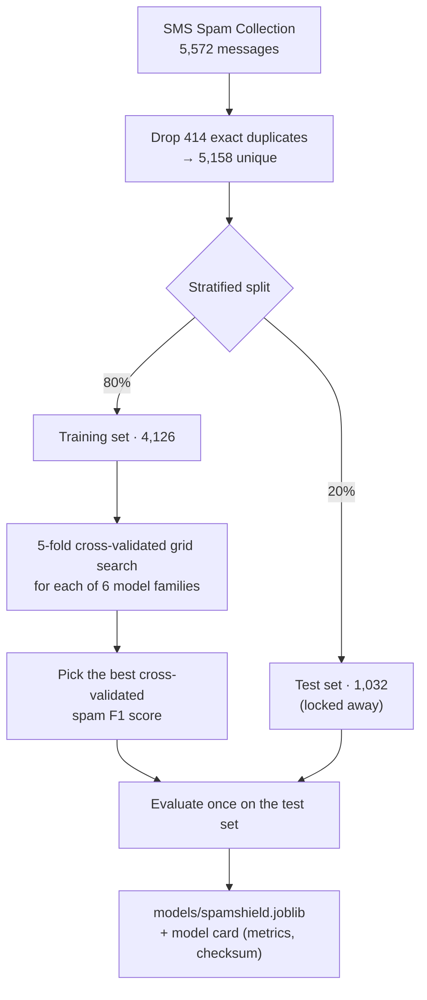

<div align="center">

# 🛡️ SpamShield

**Paste a message or upload a mailbox. SpamShield tells you how likely it is to be spam and which words gave it away.**

[](https://github.com/sakshamg251206/spamshield/actions/workflows/ci.yml)


</div>

---

## Contents

- [What is this?](#what-is-this)
- [Features](#features)
- [How it works](#how-it-works)
- [Results](#results)
- [Quick start](#quick-start)
- [Configuration](#configuration)
- [Command-line usage](#command-line-usage)
- [Testing and quality checks](#testing-and-quality-checks)
- [Deployment](#deployment)
- [Credits and licence](#credits-and-licence)

---

## What is this?

**The problem.** Spam and scam messages ("You've won a prize!", "Your account is suspended,
click here") are designed to look convincing. Telling them apart from real messages takes
attention most people don't have to spare, and getting it wrong can cost money or
personal data.

**What SpamShield does.** It is a small web app backed by a machine-learning model. You
give it text and it answers three questions:

1. **Is this spam?** A clear verdict, such as *Very likely spam* or *Probably not spam*.
2. **How sure is it?** A spam probability from 0 to 100%. When the score is close to the
   cut-off, SpamShield says so instead of pretending to be certain.
3. **Why?** The words that pushed the decision, such as *a phone number*, *claim* or *a link*.

It also scans a whole mailbox export (`.mbox`) and lists the most suspicious emails first.

**Why it exists.** It started as a learning project comparing classic machine-learning
models for spam detection. This version turns that experiment into a usable, tested,
documented tool, and shows the full path from a notebook to a deployable application:
data cleaning, honest evaluation, explainability, a usable interface, tests and CI.

> **How a spam filter "learns".** We show the computer thousands of messages that people
> have already labelled as *spam* or *not spam*. It notices which words and patterns tend to
> appear in each group, such as "WIN", "claim" or a premium-rate phone number. When it sees
> a new message, it weighs those patterns to estimate how likely the message is to be spam.

## Features

| | |
|---|---|
| ✉️ **Check a message** | Paste any SMS or email text and get a verdict, a spam probability and the words behind it. Four built-in examples let new users try it in one click. |
| 📥 **Scan a mailbox** | Upload an `.mbox` export (Gmail Takeout, Thunderbird, Apple Mail). Every email is classified, sorted by risk, filterable and searchable, and downloadable as CSV. |
| 🔍 **Explanations** | Each verdict lists the words that changed it most. This works with any model type. |
| 📊 **Transparent accuracy** | An in-app *Accuracy* tab shows held-out test results, the confusion matrix and how every candidate model scored. |
| 🔒 **Private by design** | Everything runs locally. Messages are never stored or sent to a third party, and uploaded files are deleted as soon as they are parsed. |
| 🧰 **CLI** | `spamshield train`, `spamshield predict` and `spamshield scan` for scripting and batch work. |

## How it works



1. **Normalise.** Every link becomes `urltoken` and every phone number `phonetoken`, and
   the same goes for emails, money amounts and other numbers. The model then learns
   "contains a premium phone number" instead of memorising numbers it will never see again.
2. **Vectorise.** [TF-IDF](https://en.wikipedia.org/wiki/Tf%E2%80%93idf) turns text into a
   vector where words that are frequent in this message but rare overall get more weight.
3. **Classify.** A linear Support Vector Machine draws the boundary between spam and
   normal messages. It is wrapped in probability calibration, which maps its raw scores
   to probabilities that track how often it is actually right.
4. **Explain.** Each distinct word is removed in turn and the change in the model's
   log-odds is measured. The biggest changes are shown as spam signals (red) and normal
   signals (green).

### How the model is chosen



The test set is used **once**, after the model has been chosen, so the reported numbers
show how the model performs on messages it has never seen.

## Results

From the committed model card [`models/spamshield.card.json`](models/spamshield.card.json),
produced by `spamshield train` on the 1,032-message held-out test set:

| Metric | Value | In plain English |
|---|---:|---|
| Recall (spam) | **96.1%** | Of all real spam, the share it caught |
| Precision (spam) | **94.6%** | Of everything it flagged, the share that really was spam |
| False-positive rate | **0.77%** | Normal messages wrongly flagged (7 of 904) |
| F1 (spam) | **0.953** | Balance of precision and recall |
| Accuracy | 98.8% | Share of all messages classified correctly |
| ROC-AUC | 0.999 | How well scores rank spam above normal messages |

Candidate models, ranked by 5-fold cross-validated spam F1 on the training set:

| Model | CV spam F1 |
|---|---:|
| **Linear SVM (calibrated)** ✔ | **0.956 ± 0.011** |
| Logistic Regression | 0.948 ± 0.010 |
| k-Nearest Neighbours | 0.921 ± 0.018 |
| Random Forest | 0.904 ± 0.021 |
| Complement Naive Bayes | 0.896 ± 0.013 |
| Decision Tree | 0.894 ± 0.008 |

> **Why these numbers differ from the original project.** The first version reported
> ~0.98 F1, but that figure was *weighted* across both classes, so it was dominated by the
> 87% of messages that are not spam. It was also measured on a test set that contained
> duplicates of training messages, and the best model was chosen using that same test set.
> The figures above are for the **spam class** on **deduplicated** data with a test set that
> played no part in model selection. They are lower, and they are the honest ones.

## Quick start

**Prerequisites:** Python 3.10+ and [uv](https://docs.astral.sh/uv/getting-started/installation/)
(a fast Python package manager). A trained model is committed, so no training is needed.

```bash
git clone https://github.com/sakshamg251206/spamshield.git
cd spamshield
uv sync                          # creates .venv and installs everything
uv run streamlit run app.py      # opens http://localhost:8501
```

<details>
<summary>Without uv (plain pip)</summary>

```bash
python -m venv .venv && source .venv/bin/activate   # Windows: .venv\Scripts\activate
pip install -r requirements.txt                     # pinned runtime deps + this package
streamlit run app.py
```
</details>

Prefer `make`? Run `make install`, then `make run`. `make help` lists every task.

## Configuration

Every setting is optional and has a sensible default. Copy `.env.example` to `.env` to
change them; `make run` and `docker run --env-file .env` read that file. Otherwise, set
them as normal environment variables.

| Variable | Default | Purpose |
|---|---|---|
| `SPAMSHIELD_MODEL_PATH` | `models/spamshield.joblib` | Model to load. Its `.card.json` must sit next to it. |
| `SPAMSHIELD_THRESHOLD` | `0.5` | Spam probability at which a message is flagged. Raise it to cut false alarms; lower it to catch more spam. |
| `SPAMSHIELD_MAX_MESSAGES` | `5000` | Most emails scanned from one mailbox. |
| `SPAMSHIELD_MAX_CHARS` | `20000` | Characters of one message the model reads. |
| `SPAMSHIELD_LOG_LEVEL` | `INFO` | `DEBUG`, `INFO`, `WARNING` or `ERROR`. |
| `STREAMLIT_SERVER_MAX_UPLOAD_SIZE` | `50` | Largest upload in MB (also set in `.streamlit/config.toml`). |

Invalid values, such as a threshold of `1.5`, stop the app with a clear message instead of
being silently ignored.

## Command-line usage

```bash
# Classify one message (or pipe text in on stdin)
uv run spamshield predict --explain "WINNER! Claim your £900 prize, call 09061701461 now"
# SPAM  (spam probability >99%)
#   a phone number       pushes towards spam (+4.31 log-odds)
#   a money amount       pushes towards spam (+2.53 log-odds)
#   ...

# Scan a mailbox and save the results
uv run spamshield scan ~/Downloads/All\ mail.mbox -o results.csv

# Retrain, compare all candidates and overwrite models/spamshield.joblib (~1 minute)
uv run spamshield train
uv run spamshield train --only logistic_regression naive_bayes --cv-folds 3
```

Training is deterministic (fixed random seeds), so rerunning it on the same data and
library versions selects the same model with the same metrics.

## Testing and quality checks

```bash
make check          # everything CI runs: lint, format check, type check, tests
make test           # pytest with coverage (about 5 seconds)
make lint           # ruff
make typecheck      # mypy --strict
```

The 82 tests cover:

- **Unit tests** for normalisation, dataset validation, configuration parsing, mailbox
  parsing (RFC 2047 subjects, HTML-only emails, attachments, unknown charsets, non-mbox
  files) and CSV-injection protection.
- **Model tests** that train a small model end to end, check the model card, verify that a
  tampered model file is refused, and guard the committed model's behaviour on known
  examples.
- **CLI tests** for every command, including error exit codes.
- **UI tests** that drive the real Streamlit app headlessly with
  [`AppTest`](https://docs.streamlit.io/develop/api-reference/app-testing): the empty state,
  example buttons, both verdicts, the accuracy tab and the "model missing" error screen.

Line coverage is about 96%. [GitHub Actions](.github/workflows/ci.yml) runs linting and
type checks, runs the tests on Python 3.10–3.13, checks that `requirements.txt` matches
`uv.lock`, and builds and health-checks the Docker image on every push and pull request.

## Deployment

**Docker** works on any host that runs containers (Render, Fly.io, Google Cloud Run, a VPS):

```bash
docker build -t spamshield .
docker run -p 8501:8501 --env-file .env spamshield   # --env-file is optional
```

The image installs only runtime dependencies from the lockfile, runs as a non-root user and
has a health check on `/_stcore/health`.

**Streamlit Community Cloud** (free): push the repository to GitHub, create a new app at
[share.streamlit.io](https://share.streamlit.io) and point it at `app.py`. It installs from
`requirements.txt`, which includes this package. Set any configuration under
*Settings → Secrets* as environment variables.

## Credits and licence

- Dataset: *SMS Spam Collection v.1*, T. A. Almeida and J. M. Gómez Hidalgo,
  [UCI Machine Learning Repository](https://archive.ics.uci.edu/dataset/228/sms+spam+collection),
  CC BY 4.0. See [`data/README.md`](data/README.md).
- Code: [MIT](LICENSE) © Saksham Garg.
